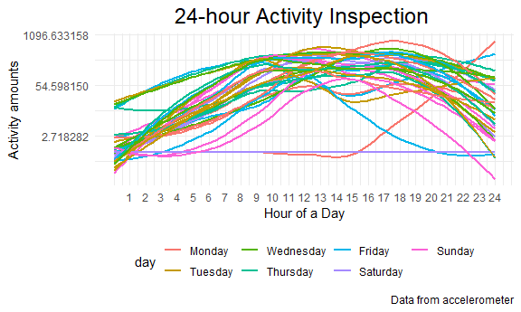
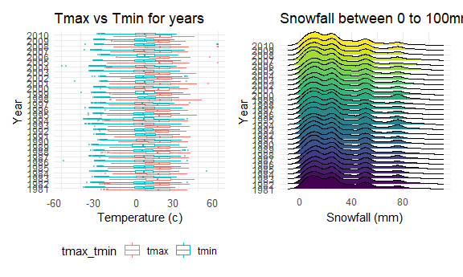

Homework 3
================
JingYao Geng
2020-10-12

### Problem 1

``` r
data("instacart")
```

This dataset contains 1384617 rows and 15 columns.

Observations are the level of items in orders by user. There are user /
order variables – user ID, order ID, order day, and order hour. There
are also item variables – name, aisle, department, and some numeric
codes.

##### How many aisles are there, and which aisles are the most items ordered from?

``` r
instacart %>%
  count(aisle) %>% # 134 by 2, count all kind of aisles
  arrange(desc(n)) # arrange aisles by its amount, or reversely arrange(n)
```

    ## # A tibble: 134 x 2
    ##    aisle                              n
    ##    <chr>                          <int>
    ##  1 fresh vegetables              150609
    ##  2 fresh fruits                  150473
    ##  3 packaged vegetables fruits     78493
    ##  4 yogurt                         55240
    ##  5 packaged cheese                41699
    ##  6 water seltzer sparkling water  36617
    ##  7 milk                           32644
    ##  8 chips pretzels                 31269
    ##  9 soy lactosefree                26240
    ## 10 bread                          23635
    ## # ... with 124 more rows

  - There are a total of 134 aisles in the instacart online grocery
    service with most items ordered from ‘fresh vegetables’ aisle.

##### Make a plot

Make a plot that shows the number of items ordered in each aisle,
limiting this to aisles with more than 10000 items ordered. Arrange
aisles sensibly, and organize your plot so others can read it.

``` r
instacart %>%
  count(aisle) %>% 
  filter(n > 10000) %>%
  mutate(
    aisle = factor(aisle), # a diff order: mutate to factor
    aisle = fct_reorder(aisle, n) # then, fct_reorder(var1, var2): reorder var1 by var2.
  ) %>%
  ggplot(aes(x = aisle, y = n)) +
  geom_point() +# google: ggplot rotate axis labels
  theme(axis.text.x = element_text(angle = 90, vjust = 0.5, hjust = 1)) # just this,looks not bad
```


##### Make a table

Make a table showing the three most popular items in each of the aisles
“baking ingredients”, “dog food care”, and “packaged vegetables
fruits”. Include the number of times each item is ordered in your
table.

``` r
instacart %>%
  filter(aisle %in% c("baking ingredients", "dog food care", "packaged vegetables fruits")) %>%
  group_by(aisle) %>% 
  count(product_name) %>% # count product_name within the aisle
  mutate(rank = min_rank(desc(n))) %>% # min_rank() helps to rank the order
  filter(rank < 4) %>%
  arrange(aisle, rank) %>%
  # arrange(desc(n)) # rank as 123123123
  # arrange(rank): rank as 111222333
  knitr::kable() #printing table
```

| aisle                      | product\_name                                 |    n | rank |
| :------------------------- | :-------------------------------------------- | ---: | ---: |
| baking ingredients         | Light Brown Sugar                             |  499 |    1 |
| baking ingredients         | Pure Baking Soda                              |  387 |    2 |
| baking ingredients         | Cane Sugar                                    |  336 |    3 |
| dog food care              | Snack Sticks Chicken & Rice Recipe Dog Treats |   30 |    1 |
| dog food care              | Organix Chicken & Brown Rice Recipe           |   28 |    2 |
| dog food care              | Small Dog Biscuits                            |   26 |    3 |
| packaged vegetables fruits | Organic Baby Spinach                          | 9784 |    1 |
| packaged vegetables fruits | Organic Raspberries                           | 5546 |    2 |
| packaged vegetables fruits | Organic Blueberries                           | 4966 |    3 |

##### Apples vs ice cream

Make a table showing the mean hour of the day at which Pink Lady Apples
and Coffee Ice Cream are ordered on each day of the week; format this
table for human readers (i.e. produce a 2 x 7 table)

``` r
instacart %>%
  filter(product_name %in% c("Pink Lady Apples", "Coffee Ice Cream")) %>%
  group_by(product_name, order_dow) %>%
  summarize(mean_hour = mean(order_hour_of_day)) %>%
  pivot_wider(
    names_from = order_dow,
    values_from = mean_hour
  )
```

    ## # A tibble: 2 x 8
    ## # Groups:   product_name [2]
    ##   product_name       `0`   `1`   `2`   `3`   `4`   `5`   `6`
    ##   <chr>            <dbl> <dbl> <dbl> <dbl> <dbl> <dbl> <dbl>
    ## 1 Coffee Ice Cream  13.8  14.3  15.4  15.3  15.2  12.3  13.8
    ## 2 Pink Lady Apples  13.4  11.4  11.7  14.2  11.6  12.8  11.9

  - On average, Coffee Ice Cream is ordered around 2:00 in the
    afternoon, and Pink Lady Apples is ordered about the noon.

### Problem 2

**Load and tidy accelerometer data**

``` r
acc_df = 
  read_csv("./data/accel_data.csv") %>%
  janitor::clean_names() %>%
  pivot_longer(
    starts_with("activity_"),
    names_to = "activity_minutes", 
    names_prefix = "activity_",
    values_to = "activity_amounts") %>% 
  mutate(
    weekday_weekend = case_when(
      day %in% c("Monday", "Tuesday", "Wednesday", "Thursday", "Friday") ~ "weekday",
      day %in% c("Sunday", "Saturday") ~ "weekend"),
    
    week = factor(week),
    day_id = as.factor(day_id),
    day = as.factor(day),
    activity_minutes = as.numeric(activity_minutes),
    activity_amounts = as.numeric(activity_amounts),
    weekday_weekend = as.factor(weekday_weekend),
    
    day = forcats::fct_relevel(day, c("Monday", "Tuesday", "Wednesday", "Thursday", "Friday", "Saturday", "Sunday"))
  ) %>%
  group_by(week) %>%
  arrange(day, .by_group = TRUE)
```

  - The original accelerometer dataset has 36 observations and 1443
    columns. However, some of the variables are easy to understand. The
    tidy-version of the accelerometer dataset has 50400 rows and 6
    columns.

**Tranditional analyses: create a table for totals**

``` r
acc_df %>%
  group_by(week,day) %>%
  summarize(total_activity = sum(activity_amounts)) %>%
  pivot_wider(
    names_from = day,
    values_from = total_activity) %>%
  knitr::kable(align = 'c')
```

| week |  Monday   | Tuesday  | Wednesday | Thursday |  Friday  | Saturday | Sunday |
| :--: | :-------: | :------: | :-------: | :------: | :------: | :------: | :----: |
|  1   | 78828.07  | 307094.2 |  340115   | 355923.6 | 480542.6 |  376254  | 631105 |
|  2   | 295431.00 | 423245.0 |  440962   | 474048.0 | 568839.0 |  607175  | 422018 |
|  3   | 685910.00 | 381507.0 |  468869   | 371230.0 | 467420.0 |  382928  | 467052 |
|  4   | 409450.00 | 319568.0 |  434460   | 340291.0 | 154049.0 |   1440   | 260617 |
|  5   | 389080.00 | 367824.0 |  445366   | 549658.0 | 620860.0 |   1440   | 138421 |

  - The activity amounts were pretty stable for Wednesday and Thursday
    during the 5-week period. Saturday seems to be the day that the man
    had least activity amounts, especially for the last 2 weeks.
    Overall, the men has less activity amounts in week 4 and 5. It seems
    to be reasonable that it’s hard to stick to one thing for a long
    time. Other trends might be difficult to find throughout the table.

**Create a plot showing 24-hour activity time courses for each day**

``` r
acc_df %>% 
  group_by(day_id, day, week) %>%
  ggplot(aes(x = activity_minutes, y = activity_amounts, color = day, group = day_id)) + 
  stat_smooth(se = F, method = "loess") +

  labs(title = "24-hour Activity Inspection ",
       caption = "Data from accelerometer",
       x = "Hour of a Day",
       y = "Activity amounts") + 
  theme(plot.title = element_text(hjust = 0.5, size = 18)) +
  scale_x_continuous(
    breaks = seq(60,1440,60), 
    labels = as.character(c(1:24))) +
  scale_y_continuous(trans = "log")
```



``` r
  viridis::scale_color_viridis(discrete = TRUE)
```

    ## <ggproto object: Class ScaleDiscrete, Scale, gg>
    ##     aesthetics: colour
    ##     axis_order: function
    ##     break_info: function
    ##     break_positions: function
    ##     breaks: waiver
    ##     call: call
    ##     clone: function
    ##     dimension: function
    ##     drop: TRUE
    ##     expand: waiver
    ##     get_breaks: function
    ##     get_breaks_minor: function
    ##     get_labels: function
    ##     get_limits: function
    ##     guide: legend
    ##     is_discrete: function
    ##     is_empty: function
    ##     labels: waiver
    ##     limits: NULL
    ##     make_sec_title: function
    ##     make_title: function
    ##     map: function
    ##     map_df: function
    ##     n.breaks.cache: NULL
    ##     na.translate: TRUE
    ##     na.value: NA
    ##     name: waiver
    ##     palette: function
    ##     palette.cache: NULL
    ##     position: left
    ##     range: <ggproto object: Class RangeDiscrete, Range, gg>
    ##         range: NULL
    ##         reset: function
    ##         train: function
    ##         super:  <ggproto object: Class RangeDiscrete, Range, gg>
    ##     rescale: function
    ##     reset: function
    ##     scale_name: viridis
    ##     train: function
    ##     train_df: function
    ##     transform: function
    ##     transform_df: function
    ##     super:  <ggproto object: Class ScaleDiscrete, Scale, gg>

  - We can see that most activities were during 8am to 9pm a day for the
    5 weeks. The activity amounts were similar in most of the days, and
    the peaks of the activity amount usually happen around noon or in
    the afternoon. Other trends are hard to tell.

### Problem 3

``` r
data("ny_noaa")
```

**A short description of the dataset**

The ny\_noaa dataset contains 7 variables and 2595176 observation value.
It displays the New York weather information from Jan. 1981 to Dec. 31
2010.

Important variables:

  - prcp: The daily precipitation volume (mm).
  - snow: The daily snowfall volume (mm).
  - snwd: The daily snow depth (mm).
  - tmax: Maximum temperature (degree C).
  - tmin: Minimum temperature (degree C).

There are a lot of missing values in variable ‘prcp’, ‘snow’, ‘snwd’,
‘tmax’, and ‘tmin’. In order to analyze the ny\_noaa dataset and do
some calculations based on the those variables, we need to remove all
missing values.

# Read and clean the data,

``` r
ny_df = ny_noaa %>% 
  janitor::clean_names() %>% 
  separate(date, into = c("year", "month", "day"), sep = "-") %>% 
  mutate(prcp = as.numeric(prcp, na.rm = TRUE),
         tmax = as.numeric(tmax, na.rm = TRUE),
         tmin = as.numeric(tmin, na.rm = TRUE),
         # reasonable units:
         prcp = prcp / 10,
         tmin = tmin / 10,
         tmax = tmax / 10)
```

  - After the step of data clean and tidy, we organized the ‘date’
    variable into ‘year’, ‘month’, and ‘day’ separately. Besides that,
    we convert variables ‘prcp’, ‘tmin’, and ‘tmax’ into mm, and degree
    C.

**For snowfall, what are the most commonly observed value?**

``` r
ny_df %>% 
  group_by(snow) %>%
  summarize(n = n()) %>% # count the snowfall volume
  filter(min_rank(desc(n)) < 2) # rank the count from large to small + the largest one
```

    ## # A tibble: 1 x 2
    ##    snow       n
    ##   <int>   <int>
    ## 1     0 2008508

  - We find the most commonly observed value in snowfall is 0mm. It’s
    reasonable that snow only happens during winter session.

**Average temperature in January and July (across station) in year 1981
and 2010.**

``` r
temp_mean <- 
  ny_df %>%
  select(id, year, month, day, tmax, tmin) %>% 
  filter( month ==  "01" | month == "07" ) %>% 
  group_by(id, year, month) %>% 
  summarise(
    mean_tmax = mean(tmax, na.rm = T)) %>% 
    drop_na(mean_tmax)
```

**The max temp plots**

``` r
ggplot(temp_mean, aes(x = as.numeric(year), y = as.numeric(mean_tmax), color = id )) +
  geom_point(alpha = 0.5) +
  scale_x_continuous(breaks = c(1981, 1985, 1990, 1995, 2000, 2005, 2010),
                  labels = c("1981", "1985", "1990", "1995", "2000", "2005", "2010")) +
  scale_y_continuous(breaks = c(-10, 0, 10, 20, 30),
                     labels = c("-10°C", "0°C", "10°C", "20°C", "30°C")) +
  labs(
    title = "Max tempreture in NY weather stations in January and July ",
    x = "Year",
    y = "Average Monthly Tempreture (°C)") + 
  theme(legend.position = "none")  +
  facet_grid(~month) +
  viridis::scale_color_viridis(discrete = TRUE, option = "plasma") 
```


  - By comparing the two plots, we find that the average temperature in
    January is always lower than the average temperature in July. It’s
    true that the former is in the winter session and the latter is in
    the summer session.

  - The January plot might somehow indicate the existence of global
    warming as the gradually increased average temperature from 1981 to
    2010 in this plot.

  - Several outliers:
    
      - There is one station that was extremely cool in 1982 in plot
        “01”.
      - There is one station that was not warm as usual in 1988 in plot
        “07”.

**Make a two-panel plot showing tmax vs tmin for the full dataset (note
that a scatterplot may not be the best option) and make a plot showing
the distribution of snowfall values greater than 0 and less than 100
separately by year.**

``` r
temp =
  ny_df %>% 
  drop_na(tmax, tmin) %>% 
  pivot_longer(
    tmax:tmin,
    names_to = "tmax_tmin",
    values_to = "temperature"
  ) %>% 
  ggplot(aes(x = temperature, y = year, color = tmax_tmin)) +
  geom_boxplot(alpha = 0.5, outlier.size = 0.1) +
  labs(
    x = "Temperature (c)",
    y = "Year",
    title = "Tmax vs Tmin for years"
    ) +
  theme(axis.text.x = element_text(angle = 0, vjust = 0.5, hjust = 1, size = 10))
        

snowfall =
  ny_df %>%
  filter(snow > 0 & snow < 100) %>%
  drop_na() %>%
  ggplot(aes(x = snow, y = year, fill = year)) +
  geom_density_ridges(scale = 3, size = 0.3) +
  #scale_x_continuous(breaks = seq(0,100,20)) +
  theme(legend.position = "none") +
  theme(
    axis.text.y = element_text(vjust = 0.5, hjust = 1, size = )
  ) +
  labs(
    title = "Snowfall between 0 to 100mm",
    x = "Snowfall (mm)",
    y = "Year")

temp + snowfall
```



  - By looking at the group boxplots, We find that the median max
    temperatures were about 15 degree C over years, and the median min
    temperatures were above 0 degree C over years.

  - By looking at the density plots, we find that the snowfall between
    0mm to 100mm were quite followed the same trend over years. Four
    local peaks can be found in general, there are around 10mm, 25mm,
    50mm, 75mm. Other trends are hard to tell.
